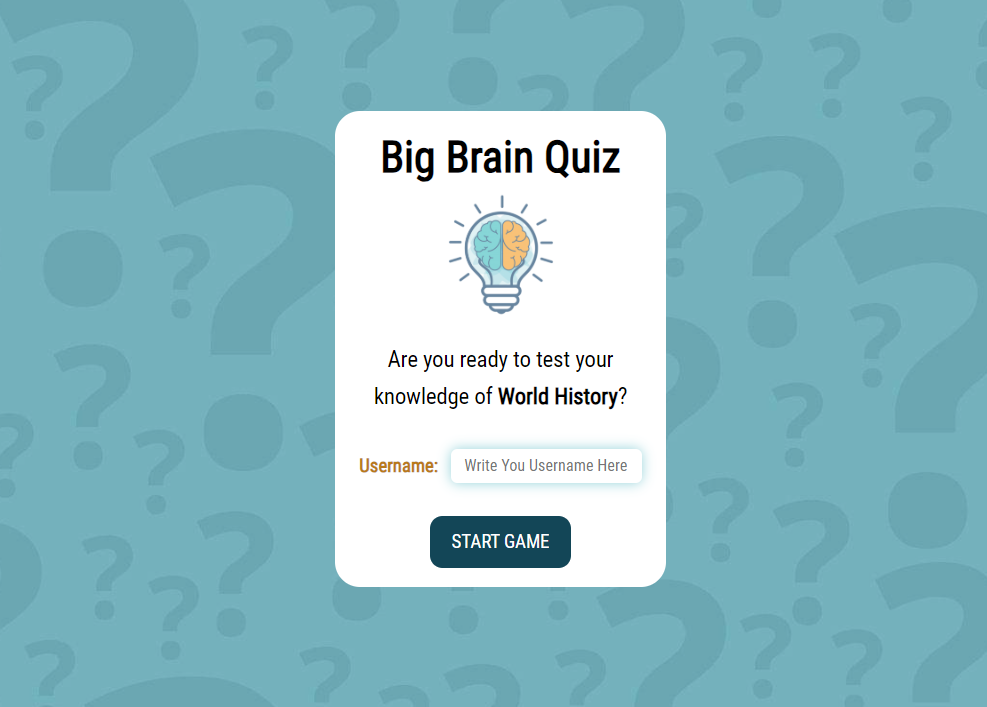
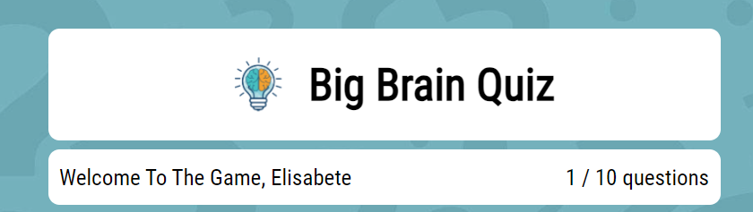

<h1>Big Brain Quiz</h1>

 Many people already know about educational quizzes, but few know their true potential.

An educational quiz is a tool that can be used in a classroom, course, or for reviewing content in a teaching process.

This game also has an evaluation method.

We can say that quizzes are a practical way of learning, because this method assesses the degree of prior knowledge of a student on a given topic, as well as evaluating what is retained after entering the classroom in an interesting and innovative way.

Visit our page by clicking here:
<a href=" https://elisabetebilini.github.io/BigBrainQuiz/"  target="_blank" rel=”noopener”> Big Brain Quiz</a>

 

 

<h2>User Experience</h2>
<h3>User stories</h3>
<ul>
<li>First Time Visitor Goals</li>
<ul>
<li>As a first-time user, I want to easily understand the main goal of the game and how it works.</li>
</ul>
<ul>
<li>That the messages are clear, and the responsiveness works correctly.</li>
</ul>
<ul>
<li>That the content is not visually polluted and does not cause unexpected distractions.</li>
</ul>
</ul>
<ul>
<li>Returning Visitor Goals</li>
<ul>
<li>As a repeat visitor, I would like to switch order of questions and answers.</li>
</ul>
</ul>
<ul>
</ul>

<h3>Design</h3>
<ul>
<li>Colour</li>
<ul>
<li>A summer color scheme has been used, happy yet calm colors that match the logo of the game very well.</li>
 

</ul>
</ul>
<ul>
<li>Typography</li>
<ul>
<li>The font selection was appropriate for the volume of text, as it helps reading with greater continuity and without so much eye strain.</li>
</ul>
</ul>
<ul>
<li>Imagery</li>
<ul>
<li>Only one background image is used, with light colors that refer to the questions theme, to keep a clean look, without visual pollution so that the user's focus is on the questionnaire.</li>
</ul>
</ul>

<h3>Flowchart</h3>

 
<h3>Wireframes</h3>

Mobile Wireframe

 

Home Page Wireframe

 
<h2>Features</h2>

<h3>Responsiveness</h3>
<ul>
<li>Viewports</li>
<ul>
<li>Desktop 1600px x 992px</li>
<li>Laptop 1280px x 802px</li>
<li>Tablet 768px x 1024px</li>
<li>Mobile 320px x 480px</li>
</ul>
</ul>

<h3>Initial Page</h3>
<ul>
<li>Start screen containing name and logo, introduction about question content.</li>
<li>It also has username input (required), a button to start the game and limited to 10 characters.</li>
</ul>

<h3>Header Game</h3>
<ul>
<li>Start screen containing name and logo.</li>
<li>Greeting the user who remains throughout the game and tracking the number of questions.</li>
</ul>

<h3>Game Page</h3>
<ul>
<li>Game screen with title and answers.</li>
<li>If the selected answer is correct the background color will be green, if the wrong answer is selected the color will be red and the right answer will appear in green. </li>
<li>Next button to advance the questions, restart button (returns to the first screen) and exit button returns the login screen.</li>
</ul>

<h3>Message Congratulations</h3>
<ul>
<li>Final message containing percentage of hits, and how many questions you got correct.</li>
<li>Play button again (restarts the game on the first question) and Exit game button (closes screen on browser and returns to home page on smaller screens).</li>
</ul>

<h3>Final thank-you message</h3>
<ul>
<li>Message thanking you for playing.</li>
</ul>

<h2>Technologies Used</h2>
<h3>Languages Used</h3>
<ul>
 <li>HTML</li>
 <li>CSS</li>
 <li>JavaScript</li>
</ul>

<h3>Frameworks, Libraries & Programs Used</h3>
<ol>
<li> <a href="https://fonts.google.com/" target="_blank" rel=”noopener”>Google Fonts</a>
<ul>
<li>Google fonts were used to import the font for copleting the design.</li>
</ul>
</li>
<li> <a href="https://balsamiq.com/" target="_blank" rel=”noopener”>Balsamic</a>
<ul>
<li>Balsamiq was used to create the wireframes during the design process.</li>
</ul>
</li>
<li> <a href="https://github.com/" target="_blank" rel=”noopener”>GitHub</a>
<ul>
<li>GitHub is used to store the projects code after being pushed from Git.</li>
</ul>
</li>
<li> <a href="https://git-scm.com/" target="_blank" rel=”noopener”>Git</a>
<ul>
<li>Git was used for version control by utilizing the Gitpod terminal to commit to Git and Push to GitHub.</li>
</ul>
</li>
<li> <a href="miro.com" target="_blank" rel=”noopener”>Miro</a>
<ul>
<li>Used to create the flowchart.</li>
</ul>
</li>
</ol>

<h2>Testing</h2>
<ul>
<li> <a href="https://validator.w3.org/" target="_blank" rel=”noopener”>W3C Markup Validator</a></li>
<li> <a href="https://jigsaw.w3.org/css-validator/#validate_by_input" target="_blank" rel=”noopener”>W3C CSS Validator</a></li>
<li> <a href="https://codebeautify.org/jsvalidate" target="_blank" rel=”noopener”>Code Beautify (JavaScript Validator)</a></li>
<li>Lighthouse (Chrome Developer Tools)</a></li>
 

 

 
</ul>

<h3>Testing User Stories from User Experience (UX) Section</h3>

<ul>
<li>As a user, I want to consume content about world history, wars and politics.</li>
<li>As a user, I want a site that is intuitive and easy to navigate.</li>
<li>As a user, I want it to challenge me to improve my knowledge.</li>
</ul>

<h3>Manual Testing</h3>

The manual test was done on a self-built desktop with an HP Pavilion Gaming Laptop, 16.1", Windows 10 Home, Intel® Core™ i5, 8GB RAM, 1TB HDD, NVIDIA® GeForce® GTX 1650 Ti

| Feature tested | Expected result                                    | Current results | Approved disapproved |
| :---           |     :---:                                          |      :---:      |                 ---: |
| Send username  |  Required User Collection.                          |   as expected   | To spend             |
| Start button   |  When clicked, the survey page should open.        |   as expected   | To spend             |
| Greetings to the user           |   Captures user name and displays it on the quiz screen along with a greeting. |   as expected   | To spend             |
| Question Counting|  Shows the number of questions answered and the quiz total.  |   as expected   | To spend             |
| Quiz|  Shows questions and answers on the screen, switching automatically after clicking on the answer.|   as expected   | To spend             |
| Scoreboard|  Scores appear at the end of the quiz, showing the number and percentage of correct answers.|   as expected   | To spend             |
| Check Answers|  Correct or Incorrect Response Message (tells you the correct answer).|   as expected   | To spend             |
| Restart Button / Play Again Button|  Guides the user to the first question and resets the score to zero.|   as expected   | To spend             |
| Exit Button|  A thank you message for playing appears on the screen.|   as expected   | To spend             |
| Final message|  Congratulates user, informs percentage and how many questions he got right.|   as expected   | To spend             |
 

<h3>Browser Test</h3>

| Browser Tested  | Work Status        |
| ----------------|--------------------|
| Microsoft Edge  |  Works as expected |
| Chrome          |  Works as expected |
| Firefox         |  Works as expected |

 
<h3>Device Test</h3>

| Browser Tested              | Work Status        |
| ----------------------------|--------------------|
| Huawei Y5                   |  Works as expected |
| Samsung Galaxy A12          |  Works as expected |
 

<h3>Improvements to be Implemented</h3>
<ul>
<li>Insert Intermediate and Advanced Levels Sections</li>
</ul>

<h3>Known Bugs</h3>
<ul>
<li>When the login screen was started an internal error and when the start game button was clicked this error disappeared and entered another in its place for the same reason.</li>
<ul>
<li>With the help of the tutors I could realize that the error was generated because there were two HTML pages, the error was solved compatctando all the content of two HTML pages in one and making the necessary adaptations in the code.</li>
 

</ul>
</ul>

<h2>Deployment</h2>
<h3>GitHub</h3>

<h4></h4>
<ol>
<li>In the GitHub body of my page, click the menu button: repository;</li>
<li>Locate the Big Brain Quiz project and click;</li>
<li>Click on the button: settings;</li>
<li>Click on the button: pages;</li>
<li>Click on the button: visit the site.</li>

</ol>
<h4>Cloning the GitHub Repository</h4>
<ol>
<li>On GitHub.com, navigate to the main page of the repository.</li>
<li>To clone your repository using the command line using HTTPS, under "Quick setup", click in copying.  To clone the repository using an SSH key, including a certificate issued by your organization's SSH certificate authority, click SSH, then click in copying.</li>
<li>Open Git Bash.</li>
<li>Change the current working directory to the location where you want the cloned directory.</li>
<li>Type git clone, and then paste the URL you copied earlier.</li>
<li>Press Enter to create your local clone.</li>
</ol>

<h2>Credits</h2>
<h3>Code</h3>

<ul>
<li> <a href="https://stackoverflow.com/" target="_blank" rel=”noopener”>Stack Overflow</a>
<ul>
<li>Used to increment the code with the restriction function to capture only letters in the input (browser).</li>
</ul>
</li>
<li> <a href="https://www.youtube.com/@CodiAcademytv" target="_blank" rel=”noopener”>Codi Academy TV</a>
<ul>
<li>Youtube channel in which I used the video / code as reference for this project.</li>
</ul>
</li>
<li> <a href="https://codeinstitute.net/ie/" target="_blank" rel=”noopener”>Code Institute</a>
<ul>
<li>README references.</li>
</ul>
<ul>
<li>The tutoring and assistance of Sara, who helped me figure out how to fix a bug in my code.</li>
</ul>
</li>
<li> <a href="https://horadecodar.com.br/" target="_blank" rel=”noopener”>Hora de Codar</a>
<ul>
<li>Channel in Portuguese where I was able to remember some of the functions, and increase the code with the SHUFFLE function.</li>
</ul>
</li>
<li> <a href="https://blog.logrocket.com/localstorage-javascript-complete-guide/" target="_blank" rel=”noopener”>LogRocket</a>
<ul>
<li>Guide localStorage in JavaScript</li>
</ul>
</li>
</ul>

<h3>Content</h3>
<ul>
<li> <a href="https://www.worldhistory.org/" target="_blank" rel=”noopener”>World History Encyclopedia</a>
<ul>
<li>All historical content.</li>
</ul>
</li>
</ul>

<h3>Media</h3>
<ul>
<li> <a href="https://br.freepik.com/" target="_blank" rel=”noopener”>Freepik</a>
<ul>
<li>Background image (question mark).</li>
</ul>
</li>
<li> <a href="https://favicon.io/" target="_blank" rel=”noopener”>Favicon</a>
<ul>
<li>Icon lamp.</li>
</ul>
</li>
    <li><a href="https://avemateiu.com/"  target="_blank" rel=”noopener”> Ave Mateiu (pallete)</a></li>
<ul>
<li>Colors.</li>
</ul>
</li>
</ul>

<h2>Acknowledgements</h2>
<ul>
<li>To my husband and my daughter for their patience during all the long hours I spent at the computer.</li>
</ul>
<ul>
<li>The Code institute team for the support and attention provided to me these past months.</li>
</ul>

